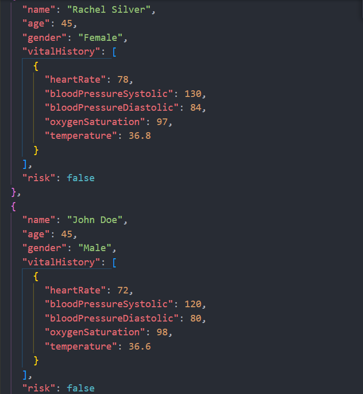
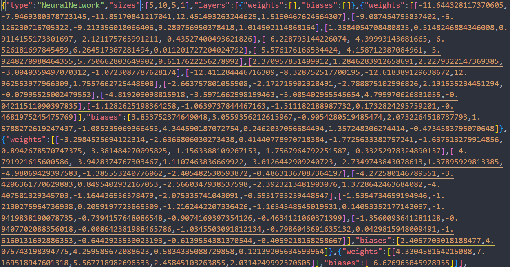
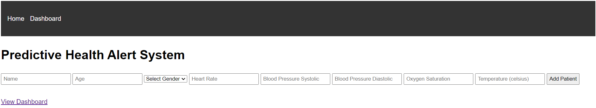
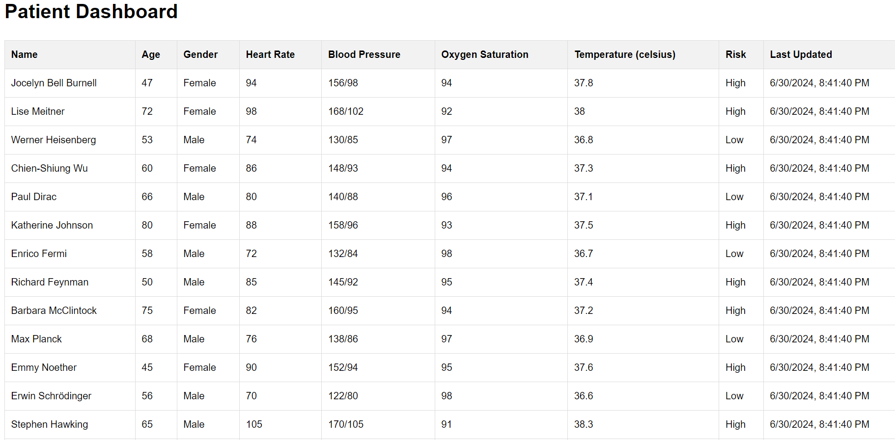

Summary: predictive healthcare system that monitors patient vital signs over time. The goal is to create an early warning system for doctors and medical staff

Data Insertion: Load sample json data into the database:



Create a training model with brain.js creating a NeuralNetwork. Normalize data to scale all inputs to a similar range.

Load up sample data from the database and use the trainingModel create to train on the sample database data and save into a train_modeled json file



Using the train_modeled.son file and brain.js for risk assessment on patients. 
Keep a traditional low and high values for vitals signs of heartRate, bloodPressureSystolic, bloodPressureDiastolic, oxygenSaturation, and temperature for when model check fails.





```plaintext
Docker Setup (make sure you have docker's account): 
1. git clone https://github.com/KonnyGuo/predictive_health_analysis.git or download as zip
2. Inside project directory terminal type: npm install.
3. Make sure you have a mongoDB atlas account. Inside configs folder. Create new file called .env and set MONGO_URI = <yourMongoDBConnection> (you need to set this up with your Mongo altas cluster connection)
4. After everything is set up In project directory terminal type: docker-compose down. Then type: docker-compose build. Then type: docker-compose up. This should have everything running in dockers.
```

Note: 
The docker files is made to automically insert data, train it and then start the application. If docker does not recognize your .env environment variabe, try setting up a same .env file within your project root.
To add or remove sample data to insert, edit the sampleData.json file in project root

```plaintext
VsCode Setup (no dockers):
1. git clone https://github.com/KonnyGuo/predictive_health_analysis.git or download as zip
2. Inside project directory terminal type: npm install.
3. Make sure you have a mongoDB atlas account. Inside configs folder. Create new file called .env and set MONGO_URI = <yourMongoDBConnection> (you need to set this up with your Mongo altas cluster connection)
4. To insert data type: npm run insert-data. To train model type: npm run train. To start application type: npm run start.
```

Important:
To avoid brain.js dependency issues I recommended LTS node (Even-numbered versions like 16, 18, 20) and 3.9-3.11 python versions.

Limitation and future improvements:

More training data needed

Different machine learning model tool

Learning model to be improved

Challenges regarding prediction implementation as data need to be constantly feed into the system
